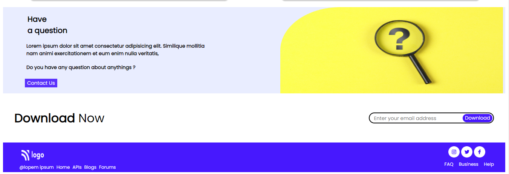

# Project-9 | API COMPANY
## Technology That I use

[Live Preview](https://project-9-api-company.netlify.app/)

## Features

- Mobile Responsive
- Tablet Responsive
- Fullscreen Responsive

## What I learn from this projects

- How to position any element
- How to make button
- How to Responsive

## Complete Time

- It's takes near about 5.30 Hrs.
